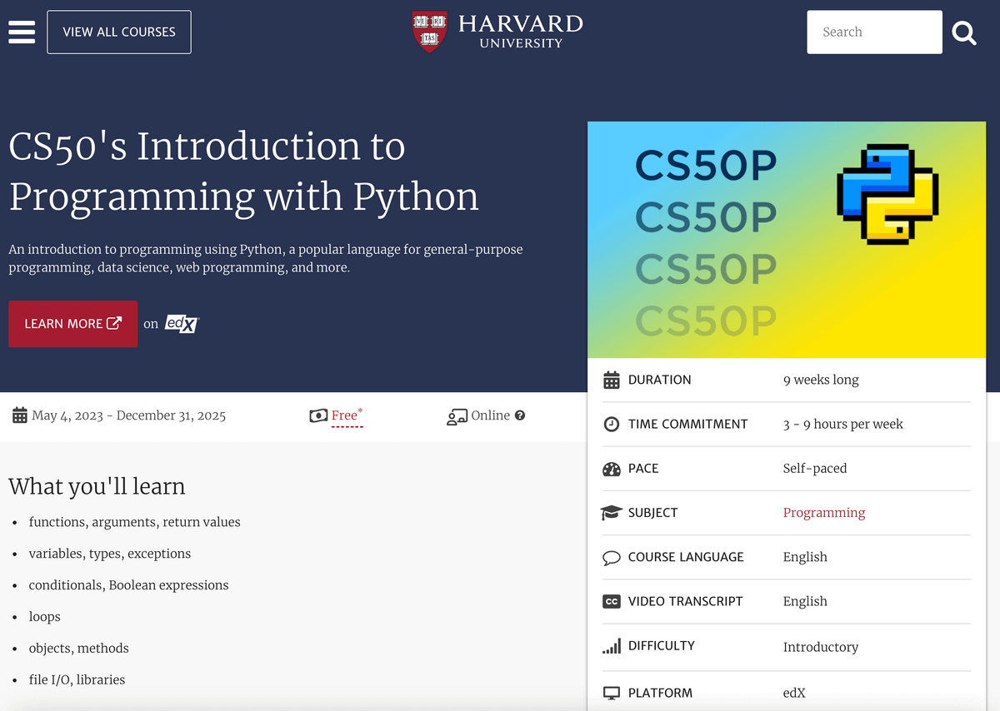
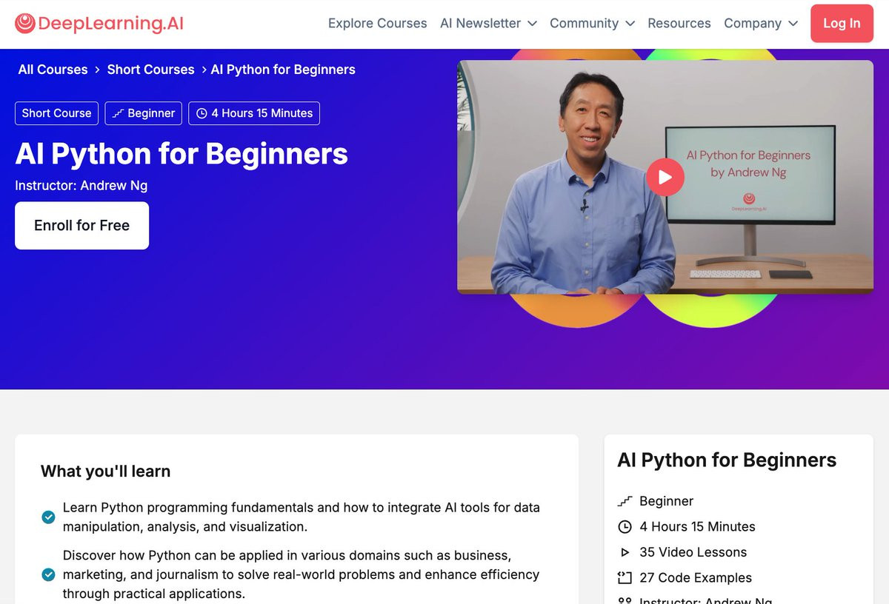
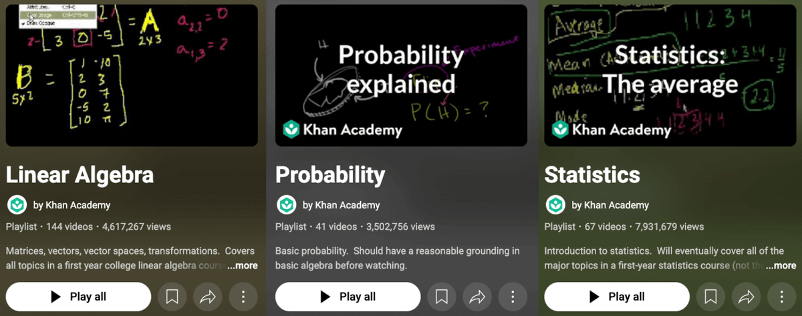
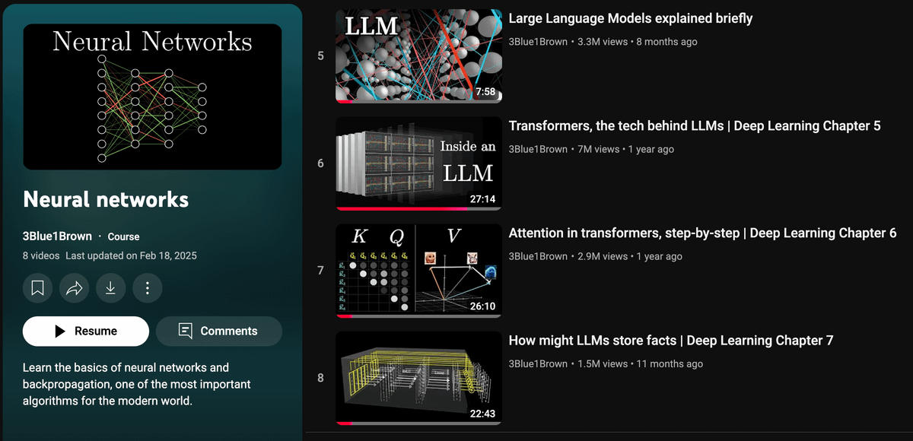
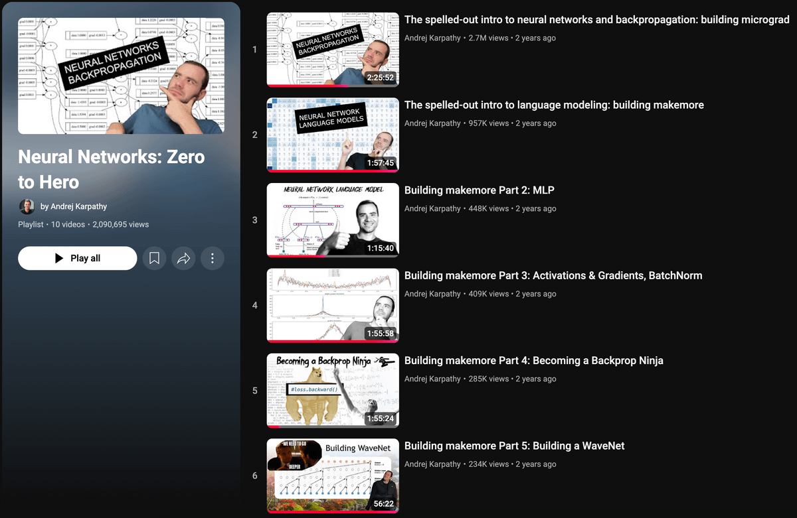
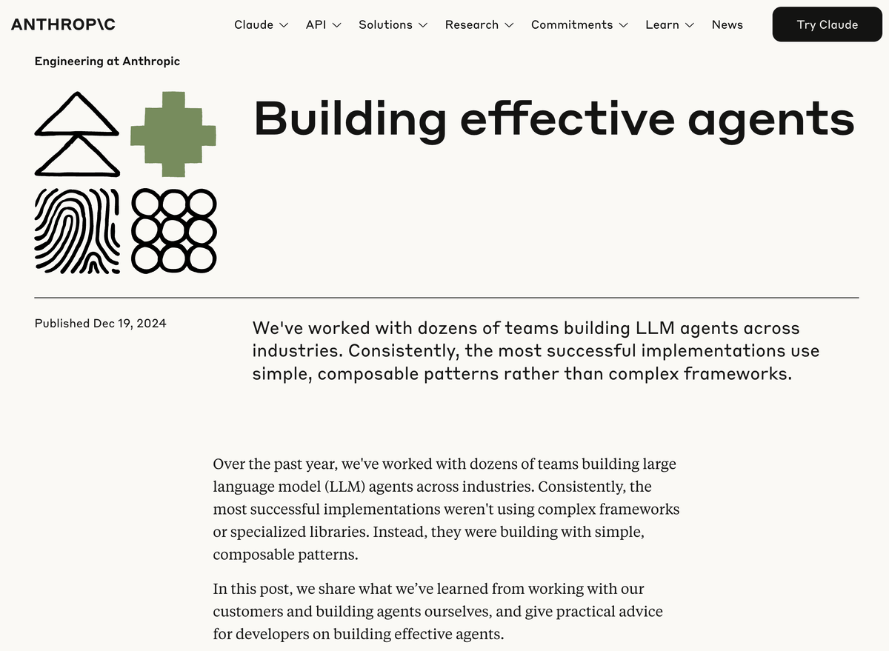
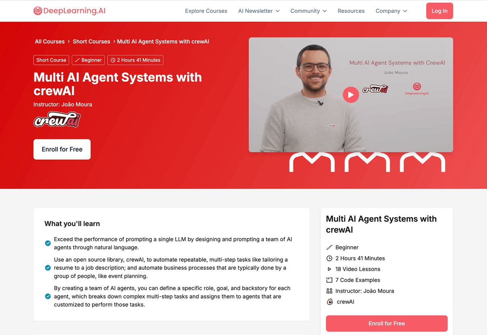
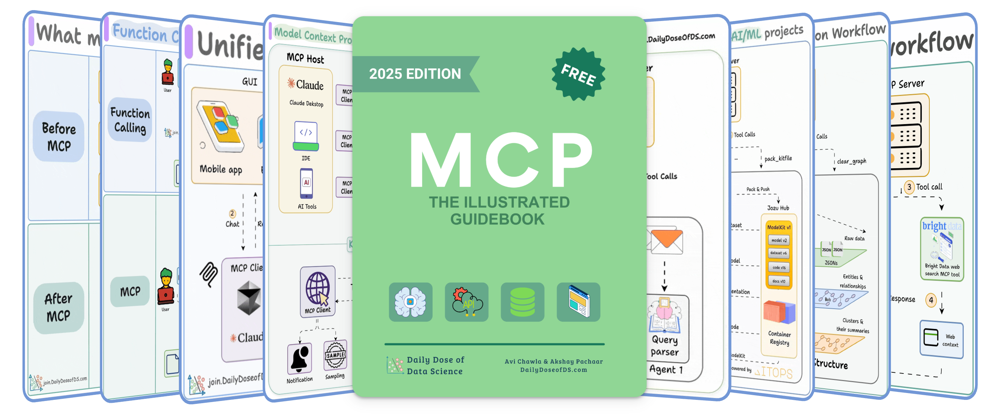
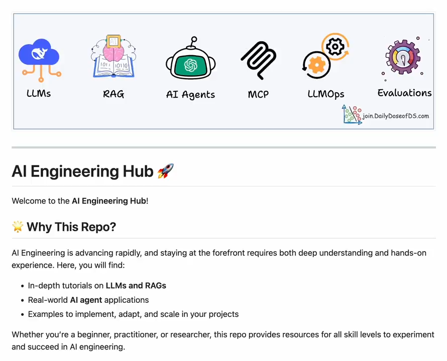
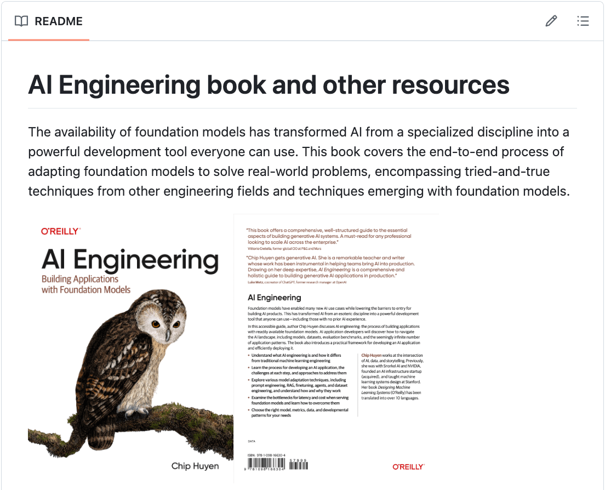

# 🚀 AI Engineering Roadmap

A comprehensive guide to becoming an AI Engineer, starting from Python fundamentals to building production-ready AI applications.

---

## 📚 Table of Contents

- [1️⃣ Master Python](#1️⃣-master-python)
- [2️⃣ AI with Python](#2️⃣-ai-with-python)
- [3️⃣ Maths for ML](#3️⃣-maths-for-ml)
- [4️⃣ Understanding LLMs](#4️⃣-understanding-llms)
- [5️⃣ LLM Research](#5️⃣-llm-research)
- [6️⃣ AI Agents](#6️⃣-ai-agents)
- [7️⃣ Applied AI](#7️⃣-applied-ai)
- [8️⃣ AI Protocols (MCP)](#8️⃣-ai-protocols-mcp)
- [9️⃣ Project-based Learning](#9️⃣-project-based-learning)
- [🔟 Books](#🔟-books)

---

## 1️⃣ Master Python

**Strong coding fundamentals are important.**

Start with Python, and Harvard's CS50p is the best place to learn it.

**🔗 [Harvard CS50's Introduction to Programming with Python](https://pll.harvard.edu/course/cs50s-introduction-programming-python)**

- **Duration:** 9 weeks
- **Time Commitment:** 3-9 hours per week
- **Difficulty:** Introductory
- **Platform:** edX

---

## 2️⃣ AI with Python

**Next, learn how Python is used in AI.**

This 4-hour course by Andrew Ng is a great starting point.

**🔗 [AI Python for Beginners - DeepLearning.AI](https://deeplearning.ai/short-courses/ai-python-for-beginners/)**

- **Duration:** 4 hours 15 minutes
- **Instructor:** Andrew Ng
- **Lessons:** 35 video lessons
- **Code Examples:** 27 code examples

---

## 3️⃣ Maths for ML

**Fundamentals of Linear Algebra, Probability, and Statistics are important, especially in AI research.**

These playlists by Khan Academy are the perfect place to learn it:

**🔗 Essential Math Playlists:**
- [Linear Algebra](https://www.youtube.com/playlist?list=PLFD0EB975BA0CC1E0)
- [Probability](https://www.youtube.com/playlist?list=PLC58778F28211FA19)
- [Statistics](https://www.youtube.com/playlist?list=PL1328115D3D8A2566)

---

## 4️⃣ Understanding LLMs

**These three videos by 3Blue1Brown are the best visual explainers of LLMs and their internal workings.**

**🔗 [Neural Networks Playlist - 3Blue1Brown](https://www.youtube.com/playlist?list=PLZHQObOWTQDNU6R1_67000Dx_ZCJB-3pi)**

**Key Topics:**
- How LLMs work
- Transformers Deep-dive
- Attention in transformers
- How LLMs store facts

---

## 5️⃣ LLM Research

**Now that you understand what LLMs are, it's time to learn how to build them yourself.**

Neural Nets zero-to-hero by Andrej Karpathy is the greatest series to do so.

**🔗 [Neural Networks: Zero to Hero - Andrej Karpathy](https://youtube.com/playlist?list=PLAqhIrjkxbuWI23v9cThsA9GvCAUhRvKZ)**

- **Videos:** 10 videos
- **Total Views:** 2M+ views
- **Focus:** Building neural networks from scratch

---

## 6️⃣ AI Agents

**Before even jumping into the Agents, you should first read Anthropic AI's guide on building effective agents.**

> *"To build an agent, you don't need complex frameworks or libraries, but rather composable patterns."*

**🔗 [Building Effective Agents - Anthropic](https://anthropic.com/engineering/building-effective-agents)**

- **Published:** December 19, 2024
- **Focus:** Simple, composable patterns for LLM agents
- **Industry Insights:** Real-world implementation patterns

---

## 7️⃣ Applied AI

**I don't recommend chasing frameworks, but I took this course on CrewAI when I started.**

João Moura precisely teaches how to think of agents like humans working together in a clear and practical manner.

**🔗 [Multi AI Agent Systems with CrewAI - Coursera](https://coursera.org/projects/multi-ai-agent-systems-with-crewai)**

- **Duration:** 2 hours 41 minutes
- **Instructor:** João Moura
- **Lessons:** 18 video lessons
- **Code Examples:** 7 code examples

---

## 8️⃣ AI Protocols (MCP)

**Now that you understand what agents are, it's time to connect them to external tools, APIs, and databases.**

This free hands-on guide on MCP has 10+ projects.

**🔗 [MCP: The Illustrated Guidebook](https://mcp.dailydoseofds.com)**

- **Edition:** 2025 Edition
- **Status:** FREE
- **Projects:** 10+ hands-on projects
- **Focus:** Model Context Protocol implementation

---

## 9️⃣ Project-based Learning

**This GitHub repo contains 75+ projects on AI Engineering covering:**

- LLMs and RAGs
- Real-world AI agent applications
- Examples to implement, adapt, and scale in your projects

**🔗 [AI Engineering Hub - GitHub](https://github.com/patchy631/ai-engineering-hub)**

**What you'll find:**
- In-depth tutorials on LLMs and RAGs
- Real-world AI agent applications
- Examples to implement, adapt, and scale in your projects
- Resources for all skill levels

---

## 🔟 Books

**Every AI engineer building real-world applications should read this book.**

Chip Huyen's book is one of the best on AI Engineering.

**🔗 [AI Engineering Book - GitHub](https://github.com/chiphuyen/aie-book)**

**What you'll learn:**
- Understand what AI engineering is and how it differs from traditional ML engineering
- Learn the process for developing an AI application
- Explore various model adaptation techniques
- Examine bottlenecks for latency and cost when serving foundation models
- Choose the right model, metrics, data, and developmental patterns

---

## 🎯 Learning Path Summary

1. **Foundation** → Master Python programming
2. **AI Basics** → Learn Python for AI applications
3. **Mathematics** → Build strong math fundamentals
4. **Understanding** → Grasp how LLMs work internally
5. **Research** → Learn to build neural networks from scratch
6. **Agents** → Understand effective agent design patterns
7. **Application** → Build multi-agent systems
8. **Integration** → Connect agents to external tools and APIs
9. **Practice** → Work on real-world projects
10. **Mastery** → Deep dive into production AI engineering

---

## 🤝 Contributing

Found this roadmap helpful? Star ⭐ this repository and share it with others!

*Happy Learning! 🚀*
