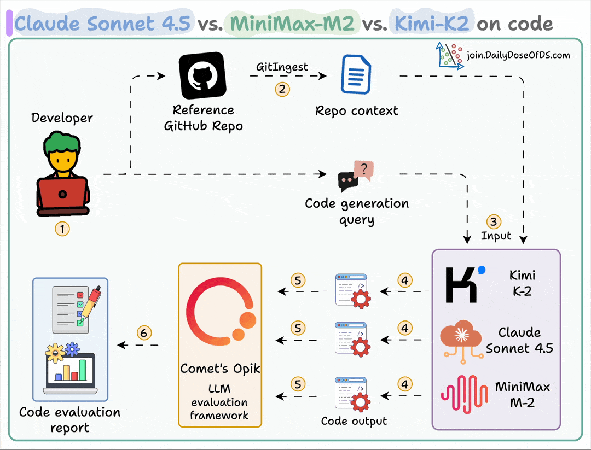
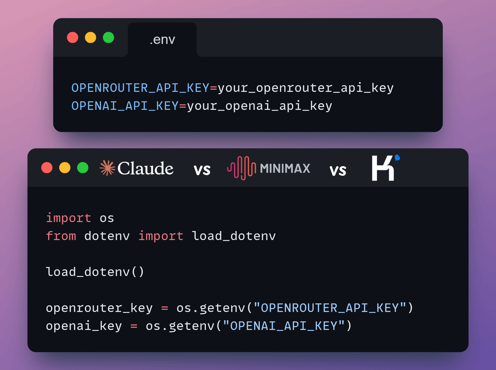
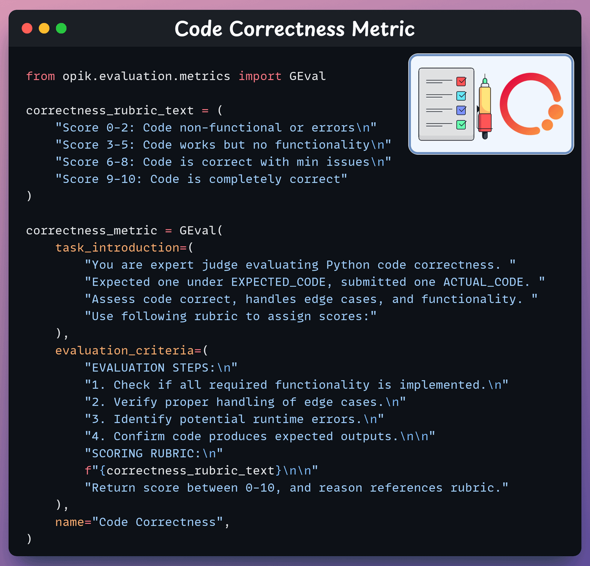
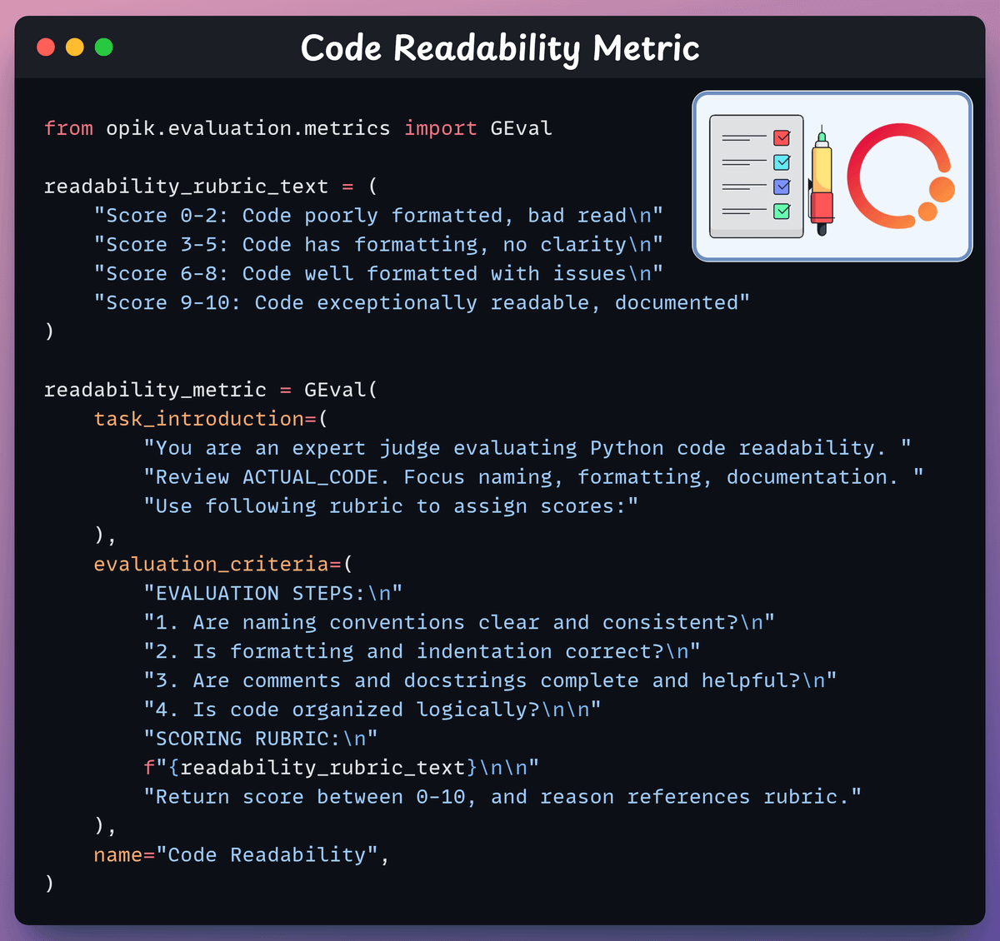
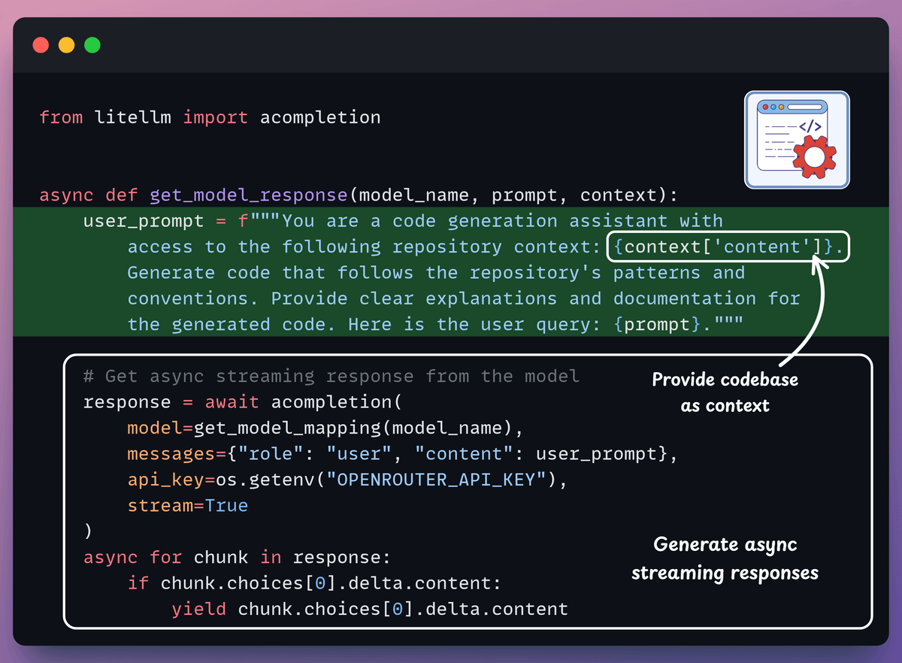
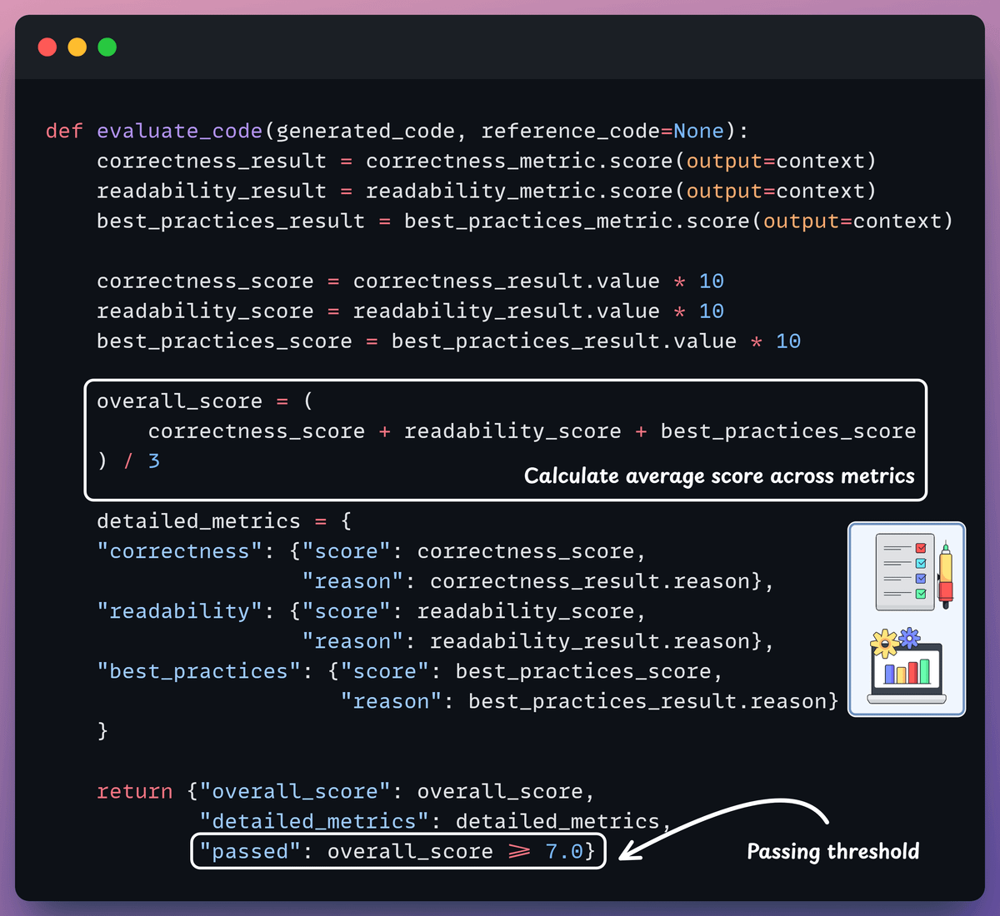
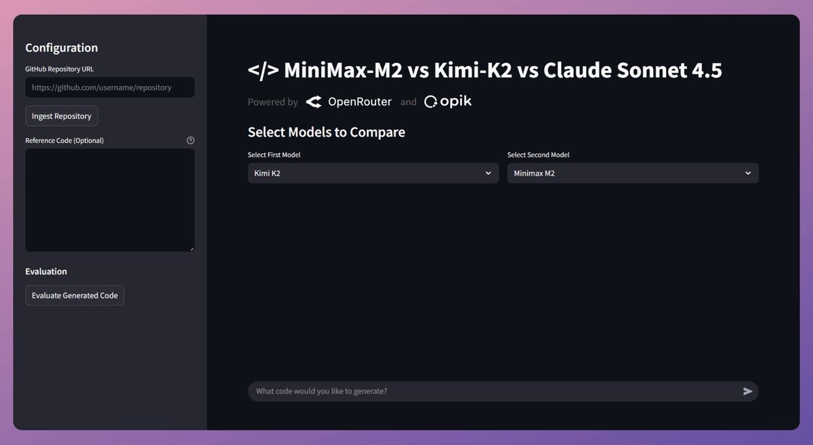
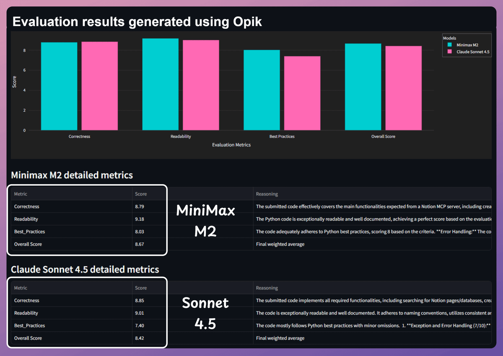
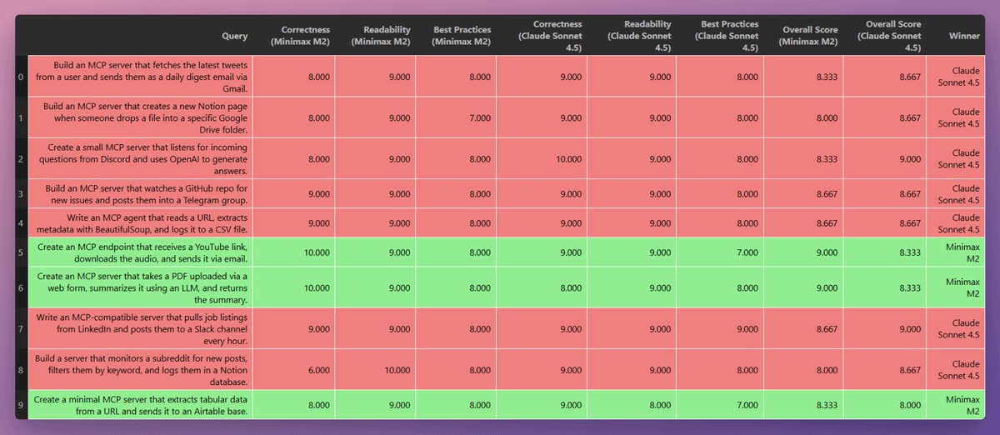
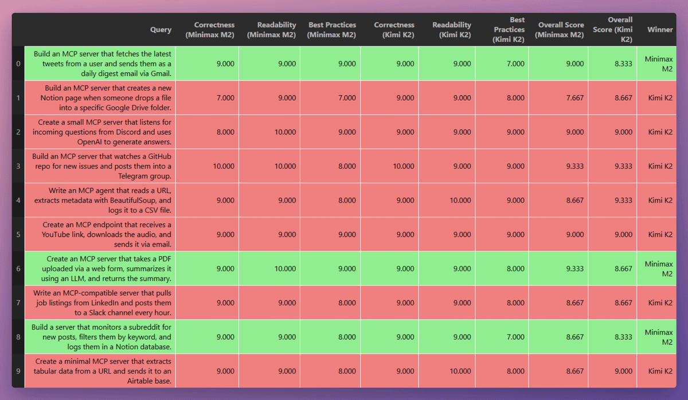

# Claude Sonnet 4.5 vs Minimax M2 vs Kimi K2 vs Gemini 3.0 on code generation using Opik

This application compares the code generation capabilities of different frontier models (MiniMax-M2, Kimi-K2, Claude Sonnet 4.5, and Gemini 3.0) that you can select from the dropdown menu, using Opik metrics. The app allows users to ingest code from a GitHub repository as context and generate new code based on that context. Both models run in parallel side by side, giving a fair comparison of their capabilities. Finally, it evaluates both models on custom code metrics and provides a detailed performance comparison with neat and clean visuals.

## Tech Stack

- **[LiteLLM](https://github.com/BerriAI/litellm)** - For orchestration and model management
- **[Opik by Comet](https://www.comet.com/)** - To build the evaluation pipeline using G-Eval
- **[OpenRouter](https://openrouter.ai/)** - To access cutting-edge models like MiniMax-M2, Gemini 3.0, Kimi-K2, and Claude Sonnet 4.5
- **[Gitingest](https://gitingest.com/)** - For ingesting code from GitHub repositories
- **[Streamlit](https://streamlit.io/)** - For the intuitive UI

## Supported Models

This application supports comparison of various frontier models accessible via OpenRouter:

- **MiniMax-M2**: Features 200k context window (128k max output tokens) with ~100 TPS throughput. Offers the best intelligence-to-cost ratio, enabling practical large-scale use cases. Currently free for developers worldwide for a limited time.
- **Kimi-K2**: High-performance model for code generation from Moonshot AI
- **Claude Sonnet 4.5**: Advanced model from Anthropic
- **Gemini 3.0**: Newest and advanced model from Google expert in code, reasoning, etc.

You'll also learn about **G-Eval** and building custom evaluation metrics through this project.

---

## Setup and Installation

Ensure you have Python 3.12 or later installed on your system.

Install dependencies:

```bash
uv sync
```

Copy `.env.example` to `.env` and configure the following environment variables:

```
OPENAI_API_KEY=your_openai_api_key_here
OPENROUTER_API_KEY=your_openrouter_api_key_here
```

**Note**: 
- OpenRouter API key is needed to access models like MiniMax-M2, Gemini 3.0, Kimi-K2, and Claude Sonnet 4.5
- OpenAI API key is required as the judge LLM in G-Eval for evaluation metrics

Look for the `.opik.config` file in the root directory and set your respective credentials for Opik.

Run the Streamlit app:

```bash
streamlit run app.py
```

## Workflow



Here's how the application works step by step:

### 0️⃣ Load API Keys

Access models like MiniMax-M2, Gemini 3.0, Kimi-K2, and Claude Sonnet 4.5 via OpenRouter. MiniMax-M2 offers ~100 TPS throughput and is scalable for enterprise use. Store your OpenRouter and OpenAI keys in the `.env` file.



### 1️⃣ Ingest GitHub Repository

Use GitIngest to convert a user-specified GitHub repository into straightforward, LLM-ready text data. LLMs will utilize this data as context to generate code in response to the user's query. MiniMax-M2's 200k context window makes it particularly well-suited for large repository understanding.


### 2️⃣ Code Correctness Metric

Create evaluation metrics using Opik's G-Eval. The code correctness metric assesses the quality and correctness of generated code by comparing it to reference ground truth code.



### 3️⃣ Code Readability Metric

This metric ensures that code adheres to proper formatting and consistent naming conventions. It also evaluates the quality of comments and docstrings, which make code easy to understand.



### 4️⃣ Best Practices Metric

This metric ensures code is modular, efficient, and implements proper error handling.


### 5️⃣ Generate Model Response

Generate responses using selected models by providing the ingested codebase as context. Results are streamed in parallel for both models, allowing for side-by-side comparison. MiniMax-M2 offers the best intelligence-to-cost ratio, enabling practical large-scale use cases.



### 6️⃣ Evaluate Generated Code

Evaluate the responses generated by models using the metrics mentioned above, providing detailed reasoning for each metric.



### 7️⃣ Streamlit UI

The intuitive Streamlit UI simplifies comparing and evaluating models within a single interface.



## Quick Start Usage

1. Select the models you want to compare from the dropdown menu
2. Enter a GitHub repository URL in the sidebar
3. Click "Ingest Repository" to load the repository context
4. Enter your code generation prompt in the chat
5. View the generated code from both models side by side
6. Click on "Evaluate Code" to evaluate code using Opik
7. View the evaluation metrics comparing both models' performance

## Evaluation Metrics

The app evaluates generated code using three comprehensive metrics powered by Opik's G-Eval:

- **Code Correctness**: Evaluates the functional correctness of the generated code

- **Code Readability**: Measures how easy the code is to understand and maintain

- **Best Practices**: Assesses adherence to coding standards and coding best practices

Each metric is scored on a scale of 0-10, with the following general interpretation:

- 0-2: Major issues or non-functional code
- 3-5: Basic implementation with significant gaps
- 6-8: Good implementation with minor issues
- 9-10: Excellent implementation meeting all criteria

The overall score is calculated as an average of these three metrics.

## Test Results

Here are some example evaluations comparing different models:

### Query 1: Build an MCP Server for GitHub

**Task**: Build an MCP server that lets AI agents and chatbots read code, manage issues/PRs, analyze repos, and automate workflows on GitHub.

**Results** (across three metrics: Correctness, Readability, and Best Practices):
- **MiniMax-M2**: 8.33
- **Kimi-K2**: 9.00


### Query 2: Build an MCP Server for Notion

**Task**: The MCP Server connects to Notion's API, enabling AI to manage notes, to-do lists, and databases for enhanced productivity and organization.

**Results**:
- **MiniMax-M2**: 8.67
- **Claude Sonnet 4.5**: 8.42



### Extended Evaluation Results

Based on 10+ evaluations using Opik on building MCP servers:

**MiniMax-M2 vs Claude Sonnet 4.5**:
- MiniMax-M2 won in 3 cases
- Claude Sonnet 4.5 won in the remaining 7 cases



**MiniMax-M2 vs Kimi-K2**:
- MiniMax-M2 won in 3 cases
- Kimi-K2 won in the remaining 7 cases



**Overall**: All models perform exceptionally well, with Kimi-K2 and Claude Sonnet 4.5 marginally outperforming in these evaluations. However, MiniMax-M2 offers significant advantages in cost-effectiveness and throughput, making it ideal for production use cases.

**Key Insight**: MiniMax-M2 is twice as fast and just 8% of Claude's price, setting a new efficiency standard. It's free for developers worldwide for a limited time—give it a try! 🚀

---

## 📬 Stay Updated with Our Newsletter!

**Get a FREE Data Science eBook** 📖 with 150+ essential lessons in Data Science when you subscribe to our newsletter! Stay in the loop with the latest tutorials, insights, and exclusive resources. [Subscribe now!](https://join.dailydoseofds.com)

[](https://join.dailydoseofds.com)

---

## Contribution

Contributions are welcome! Please fork the repository and submit a pull request with your improvements.
