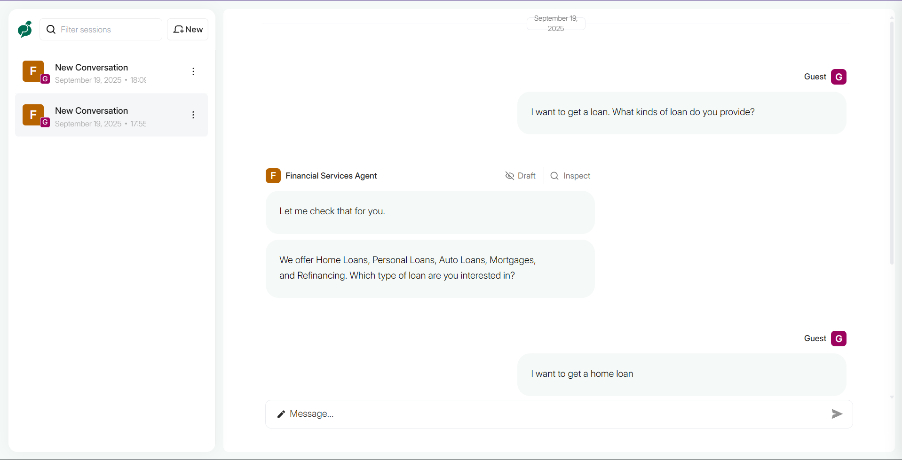
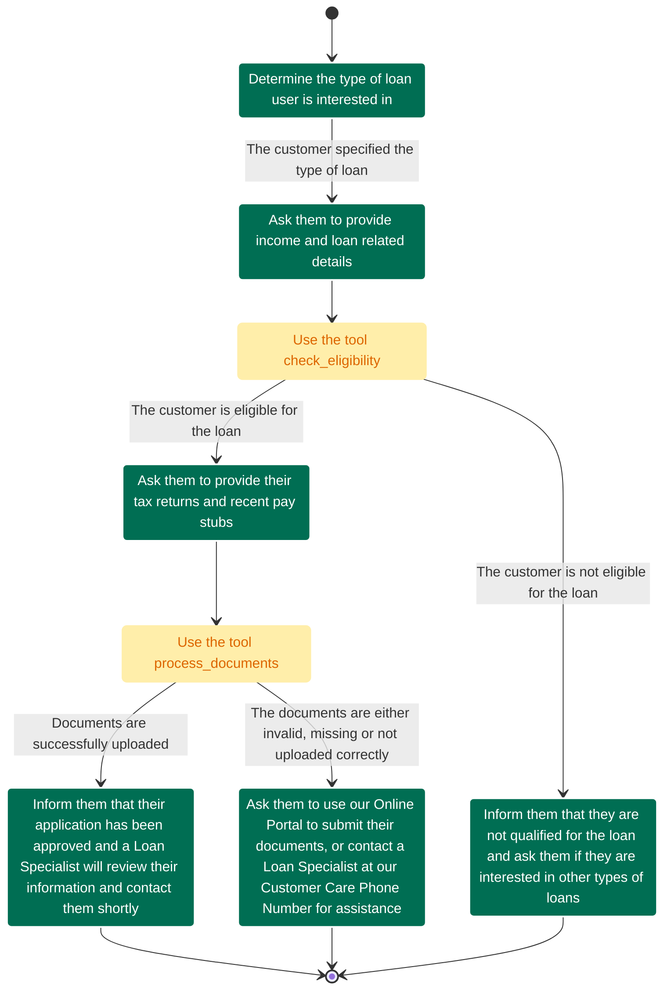

# Loan Approval Conversational Agent with Parlant

A compliance-driven conversational AI agent built with [Parlant](https://github.com/emcie-co/parlant) that guides customers through a structured loan approval process.

## Overview

This project demonstrates a financial services chatbot that helps customers navigate the loan application process. The agent uses a state-based journey to guide users through eligibility checks, document collection, and approval workflows while maintaining compliance with financial service standards using deterministic and rule-based behavioral patterns.

## Installation

1. **Prerequisites**:
- Python 3.12 +

2. **Install dependencies:**
    First, install `uv` and set up the environment:
    ```bash
    # MacOS/Linux
    curl -LsSf https://astral.sh/uv/install.sh | sh

    # Windows
    powershell -ExecutionPolicy ByPass -c "irm https://astral.sh/uv/install.ps1 | iex"
    ```

    Install dependencies:
    ```bash
    # Create a new directory for our project
    uv init research-assistant
    cd research-assistant

    # Create virtual environment and activate it
    uv venv
    source .venv/bin/activate  # MacOS/Linux

    .venv\Scripts\activate     # Windows

    # Install dependencies
    uv sync
    ```

3. Set up environment variables:
```bash
# Create a .env file with your configuration
cp .env.example .env
```

## Usage

Run the main application:
```bash
uv run loan_approval.py
```

This will start the Parlant server locally on port 8800 with the loan approval agent configured and ready to handle customer interactions.



## Loan Approval Flow

The agent follows a structured conversational journey for processing loan applications:



## Key Components

### Tools
- **`check_eligibility`**: Validates customer creditworthiness based on credit score, income, and loan amount
- **`process_documents`**: Simulates document validation for tax returns and pay stubs
- **`get_current_rates`**: Fetches current interest rates by location
- **`get_loan_types`**: Returns available loan products

### Agent Capabilities
- Domain-specific terminology understanding
- Compliance guidelines for financial advice limitations
- Structured conversation flow management
- Human handoff protocols

## 📬 Stay Updated with Our Newsletter!
**Get a FREE Data Science eBook** 📖 with 150+ essential lessons in Data Science when you subscribe to our newsletter! Stay in the loop with the latest tutorials, insights, and exclusive resources. [Subscribe now!](https://join.dailydoseofds.com)

[](https://join.dailydoseofds.com)

---

## Contribution

Contributions are welcome! Please fork the repository and submit a pull request with your improvements. 
